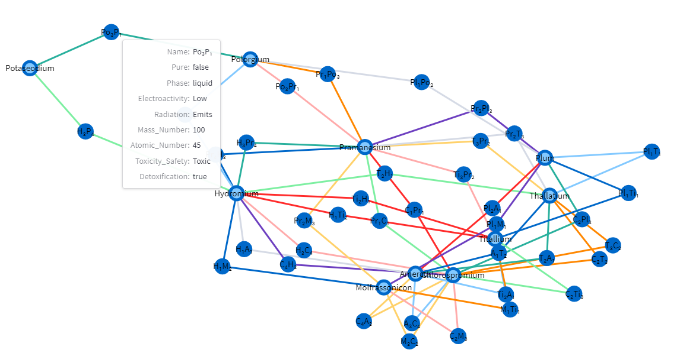

# Chemical elements generator
Have you wanted to create a world with unique chemistry for a long time? Tired of the usual hydrogen and carbon?
This application will allow you to build your chemistry, with unique elements and reactions between them.

## Usage
You can choose the number of elements you want to generate and the number of reactions you want between them.
After generation the elements will be displayed in the sidebar. You can click on the elements to see the reactions.

## Installation and running
You must have python.
Install requirements:
```
pip install -r requirements.txt
```
Run application:
```
python -m streamlit run main.py
```

## Example

Image of graph:
